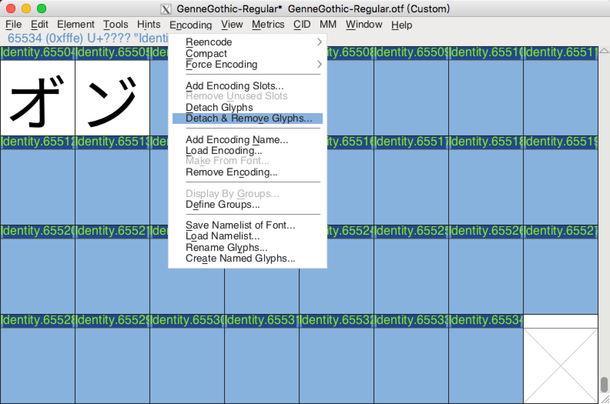

# 字型轉換流程

[返回讀我檔案](README.md)

## 首先

必須先安裝 [FontForge](https://github.com/fontforge/fontforge)、[AFDKO](https://github.com/adobe-type-tools/afdko)、試算表軟體 (Microsoft Office Excelc 或 LibreOffice Calc) 以及進階文字編輯器方可開始進行轉換工作。

 

## 開始工作

準備欲轉換的 otf 字型，放置在`Script`資料夾下。

 

## 簡化 CMap

由於 [FontForge](https://github.com/fontforge/fontforge) 無法正常讀取[思源黑體](https://github.com/adobe-fonts/source-han-sans)，當某個字圖有映射兩個以上的碼位時，會發生第二個以上的映射遺失的現象，在這裏先簡化 CMap 映射表，避免字圖名稱錯亂，影響後續的映射還原作業。

首先編寫腳本：

	#!/bin/bash
	echo FontForge+ttx otf轉ttf作業用腳本，
	echo 腳本編號01，提取並簡化cmap用腳本。
	echo --------------------
	echo 正在提取\'cmap\' Table……
	ttx -o CMap_Original.ttx -t cmap GenneGothic-Regular.otf
	echo 建立修改用副本……
	cp CMap_Original.ttx CMap_Clear.ttx
	echo 接下來請將“CMap_Clear.ttx”進行簡化修改，以利進行接下來的合併輸出作業。
	read -n 1 -p "執行完畢，請按任意鍵繼續……"
	
存檔成`01_CMapDump.sh`並在終端機下執行：

	Last login: Tue Apr 24 18:00:47 on ttys000
	User-MacBookPro:~ user$ cd Script
	User-MacBookPro:Script user$ chmod 0755 01_CMapDump.sh
	User-MacBookPro:Script user$ ./01_CMapDump.sh
	FontForge+ttx otf轉ttf作業用腳本，
	腳本編號01，提取並簡化cmap用腳本。
	--------------------
	正在提取'cmap' Table……
	Dumping "GenneGothic-Regular.otf" to "CMap_Original.ttx"...
	Dumping 'cmap' table...
	建立修改用副本……
	接下來請將“CMap_Clear.ttx”進行簡化修改，以利進行接下來的合併輸出作業。
	執行完畢，請按任意鍵繼續……

使用進階文字編輯器開啟 CMap_Clear.ttx：

	<?xml version="1.0" encoding="UTF-8"?>
	<ttFont sfntVersion="OTTO" ttLibVersion="3.0">
	
	  <cmap>
	    <tableVersion version="0"/>
	    <cmap_format_4 platformID="0" platEncID="3" language="0">
	      <map code="0x0" name="cid00001"/><!-- ???? -->
	      <map code="0x1" name="cid00001"/><!-- ???? -->
	      <map code="0x2" name="cid00001"/><!-- ???? -->
	      ------------------------------  中間省略  ------------------------------
	      <map code="0x44e" name="cid00362"/><!-- CYRILLIC SMALL LETTER YU -->
	      <map code="0x44f" name="cid00363"/><!-- CYRILLIC SMALL LETTER YA -->
	      <map code="0x451" name="cid00364"/><!-- CYRILLIC SMALL LETTER IO -->
	      <map code="0x1100" name="cid00365"/><!-- HANGUL CHOSEONG KIYEOK -->
	      <map code="0x1101" name="cid00366"/><!-- HANGUL CHOSEONG SSANGKIYEOK -->
	      <map code="0x1102" name="cid00367"/><!-- HANGUL CHOSEONG NIEUN -->
	      ------------------------------  以下省略  ------------------------------

將 Unicode 高於 1000 的值刪除：

	<?xml version="1.0" encoding="UTF-8"?>
	<ttFont sfntVersion="OTTO" ttLibVersion="3.0">
	
	  <cmap>
	    <tableVersion version="0"/>
	    <cmap_format_4 platformID="0" platEncID="3" language="0">
	      <map code="0x0" name="cid00001"/><!-- ???? -->
	      <map code="0x1" name="cid00001"/><!-- ???? -->
	      <map code="0x2" name="cid00001"/><!-- ???? -->
	      ------------------------------  中間省略  ------------------------------
	      <map code="0x44e" name="cid00362"/><!-- CYRILLIC SMALL LETTER YU -->
	      <map code="0x44f" name="cid00363"/><!-- CYRILLIC SMALL LETTER YA -->
	      <map code="0x451" name="cid00364"/><!-- CYRILLIC SMALL LETTER IO -->
	    </cmap_format_4>
	      ------------------------------  以下省略  ------------------------------

同樣的值還有三個地方：

	      ------------------------------  以上省略  ------------------------------
	    <cmap_format_12 platformID="0" platEncID="4" format="12" reserved="0" length="196276" language="0" nGroups="16355">
	      ------------------------------  中間省略  ------------------------------
	      <map code="0x44e" name="cid00362"/><!-- CYRILLIC SMALL LETTER YU -->
	      <map code="0x44f" name="cid00363"/><!-- CYRILLIC SMALL LETTER YA -->
	      <map code="0x451" name="cid00364"/><!-- CYRILLIC SMALL LETTER IO -->
	      <map code="0x1100" name="cid00365"/><!-- HANGUL CHOSEONG KIYEOK -->
	      ------------------------------  中間省略  ------------------------------
	    </cmap_format_12>
	    <cmap_format_6 platformID="1" platEncID="1" language="0">
	      <map code="0x0" name=".notdef"/>
	    </cmap_format_6>
	    <cmap_format_4 platformID="3" platEncID="1" language="0">
	      ------------------------------  中間省略  ------------------------------
	      <map code="0x44e" name="cid00362"/><!-- CYRILLIC SMALL LETTER YU -->
	      <map code="0x44f" name="cid00363"/><!-- CYRILLIC SMALL LETTER YA -->
	      <map code="0x451" name="cid00364"/><!-- CYRILLIC SMALL LETTER IO -->
	      <map code="0x1100" name="cid00365"/><!-- HANGUL CHOSEONG KIYEOK -->
	      ------------------------------  中間省略  ------------------------------
	    </cmap_format_4>
	    <cmap_format_12 platformID="3" platEncID="10" format="12" reserved="0" length="196276" language="0" nGroups="16355">
	      ------------------------------  中間省略  ------------------------------
	      <map code="0x44e" name="cid00362"/><!-- CYRILLIC SMALL LETTER YU -->
	      <map code="0x44f" name="cid00363"/><!-- CYRILLIC SMALL LETTER YA -->
	      <map code="0x451" name="cid00364"/><!-- CYRILLIC SMALL LETTER IO -->
	      <map code="0x1100" name="cid00365"/><!-- HANGUL CHOSEONG KIYEOK -->
	      ------------------------------  中間省略  ------------------------------
	    </cmap_format_12>
	  </cmap>
	
	</ttFont>

依序刪除：

	    <cmap_format_12 platformID="0" platEncID="4" format="12" reserved="0" length="196276" language="0" nGroups="16355">
	      ------------------------------  中間省略  ------------------------------
	      <map code="0x44e" name="cid00362"/><!-- CYRILLIC SMALL LETTER YU -->
	      <map code="0x44f" name="cid00363"/><!-- CYRILLIC SMALL LETTER YA -->
	      <map code="0x451" name="cid00364"/><!-- CYRILLIC SMALL LETTER IO -->
	    </cmap_format_12>
	    <cmap_format_6 platformID="1" platEncID="1" language="0">
	      <map code="0x0" name=".notdef"/>
	    </cmap_format_6>
	    <cmap_format_4 platformID="3" platEncID="1" language="0">
	      ------------------------------  中間省略  ------------------------------
	      <map code="0x44e" name="cid00362"/><!-- CYRILLIC SMALL LETTER YU -->
	      <map code="0x44f" name="cid00363"/><!-- CYRILLIC SMALL LETTER YA -->
	      <map code="0x451" name="cid00364"/><!-- CYRILLIC SMALL LETTER IO -->
	    </cmap_format_4>
	    <cmap_format_12 platformID="3" platEncID="10" format="12" reserved="0" length="196276" language="0" nGroups="16355">
	      ------------------------------  中間省略  ------------------------------
	      <map code="0x44e" name="cid00362"/><!-- CYRILLIC SMALL LETTER YU -->
	      <map code="0x44f" name="cid00363"/><!-- CYRILLIC SMALL LETTER YA -->
	      <map code="0x451" name="cid00364"/><!-- CYRILLIC SMALL LETTER IO -->
	    </cmap_format_12>
	  </cmap>
	
	</ttFont>

* 備註：cmap_format_12 的表格包含 [Unicode 基本多文種平面](https://zh.wikipedia.org/wiki/Unicode字符平面映射)以外的字元，cmap_format_4 則不包含。

 

## 合併簡化 CMap 到 otf 字型上

編寫第二個腳本：

	#!/bin/bash
	echo FontForge+ttx otf轉ttf作業用腳本，
	echo 腳本編號02，合併輸出簡化cmap用腳本。
	echo --------------------
	echo 將“GenneGothic.otf”與“CMap_Clear.ttx”合併成FontForge otf2ttf用字型中……
	ttx -o CMapClear-ExtraLight.otf -m GenneGothic-ExtraLight.otf CMap_Clear.ttx
	ttx -o CMapClear-Light.otf -m GenneGothic-Light.otf CMap_Clear.ttx
	ttx -o CMapClear-Normal.otf -m GenneGothic-Normal.otf CMap_Clear.ttx
	ttx -o CMapClear-Regular.otf -m GenneGothic-Regular.otf CMap_Clear.ttx
	ttx -o CMapClear-Medium.otf -m GenneGothic-Medium.otf CMap_Clear.ttx
	ttx -o CMapClear-Bold.otf -m GenneGothic-Bold.otf CMap_Clear.ttx
	ttx -o CMapClear-Heavy.otf -m GenneGothic-Heavy.otf CMap_Clear.ttx
	echo 建立輸出資料夾……
	mkdir Output
	echo 移動至輸出資料夾以及更名字型……
	mv CMapClear-ExtraLight.otf Output
	mv CMapClear-Light.otf Output
	mv CMapClear-Normal.otf Output
	mv CMapClear-Regular.otf Output
	mv CMapClear-Medium.otf Output
	mv CMapClear-Bold.otf Output
	mv CMapClear-Heavy.otf Output
	cd Output
	mv CMapClear-ExtraLight.otf GenneGothic-ExtraLight.otf
	mv CMapClear-Light.otf GenneGothic-Light.otf
	mv CMapClear-Normal.otf GenneGothic-Normal.otf
	mv CMapClear-Regular.otf GenneGothic-Regular.otf
	mv CMapClear-Medium.otf GenneGothic-Medium.otf
	mv CMapClear-Bold.otf GenneGothic-Bold.otf
	mv CMapClear-Heavy.otf GenneGothic-Heavy.otf
	echo 接下來請使用FontForge開啟轉換後的字型，平面化CID字型並刪除尾端空白字圖後轉存成ttf\(將輸出選項內的PS字圖名稱取消勾選\)。
	read -n 1 -p "執行完畢，請按任意鍵繼續……"

存檔成`02_Output.sh`並在終端機下執行：

	Last login: Tue Apr 24 18:15:51 on ttys000
	User-MacBookPro:~ user$ cd Script
	User-MacBookPro:Script user$ chmod 0755 02_Output.sh
	User-MacBookPro:Script user$ ./02_Output.sh
	FontForge+ttx otf轉ttf作業用腳本，
	腳本編號02，合併輸出簡化cmap用腳本。
	--------------------
	將“GenneGothic.otf”與“CMap_Clear.ttx”合併成FontForge otf2ttf用字型中……
	Compiling "CMap_Clear.ttx" to "CMapClear-ExtraLight.otf"...
	Parsing 'cmap' table...
	Compiling "CMap_Clear.ttx" to "CMapClear-Light.otf"...
	Parsing 'cmap' table...
	Compiling "CMap_Clear.ttx" to "CMapClear-Normal.otf"...
	Parsing 'cmap' table...
	Compiling "CMap_Clear.ttx" to "CMapClear-Regular.otf"...
	Parsing 'cmap' table...
	Compiling "CMap_Clear.ttx" to "CMapClear-Medium.otf"...
	Parsing 'cmap' table...
	Compiling "CMap_Clear.ttx" to "CMapClear-Bold.otf"...
	Parsing 'cmap' table...
	Compiling "CMap_Clear.ttx" to "CMapClear-Heavy.otf"...
	Parsing 'cmap' table...
	建立輸出資料夾……
	移動至輸出資料夾以及更名字型……
	接下來請使用FontForge開啟轉換後的字型，平面化CID字型並刪除尾端空白字圖後轉存成ttf(將輸出選項內的PS字圖名稱取消勾選)。
	執行完畢，請按任意鍵繼續……

完成後進入`Output`資料夾繼續作業。

 

## 使用 [FontForge](https://github.com/fontforge/fontforge) 轉換字型

首先必須刪除以下位置內：

MacOS: `/Applications/FontForge.app/Contents/Resources/opt/local/share/fontforge`

Linux: `/usr/local/share/fontforge`

Windows unofficial fontforge-cygwin: `./usr/local/share/fontforge`

所有副檔名為 cidmap 的檔案：

`Adobe-CNS1-6.cidmap`
`Adobe-GB1-5.cidmap`
`Adobe-Identity-0.cidmap`
`Adobe-Japan1-5.cidmap`
`Adobe-Japan1-6.cidmap`
`Adobe-Japan2-0.cidmap`
`Adobe-Korea1-2.cidmap`

否則開啟 otf 字型後映射會發生錯亂。

開啟 [FontForge](https://github.com/fontforge/fontforge) 並開啟已被簡化 CMap 的 otf 字型：

首先在選單列上選擇「CID」→「平面化」來平面化字型。

然後在選單列上選擇「元件」→「字型資訊…」。

進入「字型資訊…」後，點選左側選單的「一般」。

將「Em 大小」內的數值從 1000 改為 1024 後按下確認。

待轉換完成後，刪除字型尾端 29 個空白字圖。

最後點選功能選單列「檔案」→「生成字型」。

格式選擇“TrueType”，然後點選「選項」按鈕，並取消勾選「PS 字圖名稱」，並按下確定。

設定完成後，按下「生成」來生成字型。

重複以上方式對剩下的六個字重進行轉換。

 

## 提取轉換後字型的 CMap 以進行映射還原

編寫第三個腳本：

	#!/bin/bash
	echo FontForge+ttx otf轉ttf作業用腳本，
	echo 腳本編號03，提取otf2ttf後\'cmap\' Table用腳本。
	echo --------------------
	echo 正在提取Regular字重的\'cmap\' Table……
	ttx -o CMap_ttfMerge.ttx -t cmap GenneGothic-Regular.ttf
	echo 請依照原始字型的CMap表進行“CMap_ttfMerge.ttx”的修改，字圖名稱請使用FontForge查看，若不知道如何編輯可以參照樣本。
	read -n 1 -p "執行完畢，請按任意鍵繼續……"

存檔成`03_ttfCMapDump.sh`並在終端機下執行：

	Last login: Tue Apr 24 22:49:21 on ttys001
	User-MacBookPro:~ user$ cd Script/Output/
	User-MacBookPro:Output user$ chmod 0755 03_ttfCMapDump.sh
	User-MacBookPro:Output user$ ./03_ttfCMapDump.sh 
	FontForge+ttx otf轉ttf作業用腳本，
	腳本編號03，提取otf2ttf後'cmap' Table用腳本。
	--------------------
	正在提取Regular字重的'cmap' Table……
	Dumping "GenneGothic-Regular.ttf" to "CMap_ttfMerge.ttx"...
	Dumping 'cmap' table...
	請依照原始字型的CMap表進行“CMap_ttfMerge.ttx”的修改，字圖名稱請使用FontForge查看，若不知道如何編輯可以參照樣本。
	執行完畢，請按任意鍵繼續……

使用進階文字編輯器開啟上一層目錄的 CMap_Original.ttx：

	<?xml version="1.0" encoding="UTF-8"?>
	<ttFont sfntVersion="OTTO" ttLibVersion="3.0">
	
	  <cmap>
	      ------------------------------  中間省略  ------------------------------
	    <cmap_format_12 platformID="0" platEncID="4" format="12" reserved="0" length="196276" language="0" nGroups="16355">
	      ------------------------------  中間省略  ------------------------------
	      <map code="0x44e" name="cid00362"/><!-- CYRILLIC SMALL LETTER YU -->
	      <map code="0x44f" name="cid00363"/><!-- CYRILLIC SMALL LETTER YA -->
	      <map code="0x451" name="cid00364"/><!-- CYRILLIC SMALL LETTER IO -->
	      <map code="0x1100" name="cid00365"/><!-- HANGUL CHOSEONG KIYEOK -->
	      <map code="0x1101" name="cid00366"/><!-- HANGUL CHOSEONG SSANGKIYEOK -->
	      <map code="0x1102" name="cid00367"/><!-- HANGUL CHOSEONG NIEUN -->
	      ------------------------------  中間省略  ------------------------------
	    </cmap_format_12>
	      ------------------------------  以下省略  ------------------------------

將 cmap_format_12 底下 Unicode 高於 1000 的值複製起來。

新建空白文字檔並貼上。

	      ------------------------------  以上省略  ------------------------------
	      <map code="0x1100" name="cid00365"/><!-- HANGUL CHOSEONG KIYEOK -->
	      ------------------------------  中間省略  ------------------------------
	      <map code="0x4e00" name="cid09831"/><!-- CJK UNIFIED IDEOGRAPH-4E00 -->
	      <map code="0x4e01" name="cid09832"/><!-- CJK UNIFIED IDEOGRAPH-4E01 -->
	      <map code="0x4e02" name="cid09833"/><!-- CJK UNIFIED IDEOGRAPH-4E02 -->
	      ------------------------------  以下省略  ------------------------------

用尋找/取代方式將 cid 與數字用任一符號區隔開來。

	      ------------------------------  以上省略  ------------------------------
	      <map code="0x1100" name="cid@00365@"/><!-- HANGUL CHOSEONG KIYEOK -->
	      ------------------------------  中間省略  ------------------------------
	      <map code="0x4e00" name="cid@09831@"/><!-- CJK UNIFIED IDEOGRAPH-4E00 -->
	      <map code="0x4e01" name="cid@09832@"/><!-- CJK UNIFIED IDEOGRAPH-4E01 -->
	      <map code="0x4e02" name="cid@09833@"/><!-- CJK UNIFIED IDEOGRAPH-4E02 -->
	      ------------------------------  以下省略  ------------------------------

並貼上到試算表軟體上進行處理。

使用 [FontForge](https://github.com/fontforge/fontforge) 開啟已被簡化 CMap 的 otf 字型以及轉換後的 ttf 字型。

比對兩個數字的偏移值，參照偏移值並將其反映到映射表上。

修改後貼回新文字檔上面，並將多餘的製表符或空格用尋找/取代方式消除後，應該會變成以下的樣子：

	      ------------------------------  以上省略  ------------------------------
	      <map code="0x1100" name="glyph00367"/><!-- HANGUL CHOSEONG KIYEOK -->
	      <map code="0x1101" name="glyph00368"/><!-- HANGUL CHOSEONG SSANGKIYEOK -->
	      <map code="0x1102" name="glyph00369"/><!-- HANGUL CHOSEONG NIEUN -->
	      ------------------------------  中間省略  ------------------------------
	      <map code="0x4e00" name="glyph09833"/><!-- CJK UNIFIED IDEOGRAPH-4E00 -->
	      <map code="0x4e01" name="glyph09834"/><!-- CJK UNIFIED IDEOGRAPH-4E01 -->
	      <map code="0x4e02" name="glyph09835"/><!-- CJK UNIFIED IDEOGRAPH-4E02 -->
	      ------------------------------  以下省略  ------------------------------

使用進階文字編輯器開啟 CMap_ttfMerge.ttx：

首先將 cmap_format_4 映射表 U+0000~U+0020從：

	      ------------------------------  以上省略  ------------------------------
	      <map code="0x0" name="glyph00001"/>
	      <map code="0x8" name="glyph00001"/>
	      <map code="0x9" name="glyph00002"/>
	      <map code="0xd" name="glyph00002"/>
	      <map code="0x1d" name="glyph00001"/>
	      ------------------------------  以下省略  ------------------------------

取代為：

	      ------------------------------  以上省略  ------------------------------
	      <map code="0x0" name="uni00A0"/><!-- ???? -->
	      <map code="0x1" name="uni00A0"/><!-- ???? -->
	      <map code="0x2" name="uni00A0"/><!-- ???? -->
	      <map code="0x3" name="uni00A0"/><!-- ???? -->
	      <map code="0x4" name="uni00A0"/><!-- ???? -->
	      <map code="0x5" name="uni00A0"/><!-- ???? -->
	      <map code="0x6" name="uni00A0"/><!-- ???? -->
	      <map code="0x7" name="uni00A0"/><!-- ???? -->
	      <map code="0x8" name="uni00A0"/><!-- ???? -->
	      <map code="0x9" name="uni00A0"/><!-- ???? -->
	      <map code="0xa" name="uni00A0"/><!-- ???? -->
	      <map code="0xb" name="uni00A0"/><!-- ???? -->
	      <map code="0xc" name="uni00A0"/><!-- ???? -->
	      <map code="0xd" name="uni00A0"/><!-- ???? -->
	      <map code="0xe" name="uni00A0"/><!-- ???? -->
	      <map code="0xf" name="uni00A0"/><!-- ???? -->
	      <map code="0x10" name="uni00A0"/><!-- ???? -->
	      <map code="0x11" name="uni00A0"/><!-- ???? -->
	      <map code="0x12" name="uni00A0"/><!-- ???? -->
	      <map code="0x13" name="uni00A0"/><!-- ???? -->
	      <map code="0x14" name="uni00A0"/><!-- ???? -->
	      <map code="0x15" name="uni00A0"/><!-- ???? -->
	      <map code="0x16" name="uni00A0"/><!-- ???? -->
	      <map code="0x17" name="uni00A0"/><!-- ???? -->
	      <map code="0x18" name="uni00A0"/><!-- ???? -->
	      <map code="0x19" name="uni00A0"/><!-- ???? -->
	      <map code="0x1a" name="uni00A0"/><!-- ???? -->
	      <map code="0x1b" name="uni00A0"/><!-- ???? -->
	      <map code="0x1c" name="uni00A0"/><!-- ???? -->
	      <map code="0x1d" name="uni00A0"/><!-- ???? -->
	      <map code="0x1e" name="uni00A0"/><!-- ???? -->
	      <map code="0x1f" name="uni00A0"/><!-- ???? -->
	      <map code="0x20" name="uni00A0"/><!-- SPACE -->
	      ------------------------------  以下省略  ------------------------------

然後將 cmap_format_6 的映射表：

	      ------------------------------  以上省略  ------------------------------
    <cmap_format_6 platformID="1" platEncID="0" language="0">
	      <map code="0x0" name="glyph00001"/>
	      <map code="0x8" name="glyph00001"/>
	      <map code="0x9" name="glyph00002"/>
	      <map code="0xd" name="glyph00002"/>
	      <map code="0x1d" name="glyph00001"/>
	      ------------------------------  中間省略  ------------------------------
	      <map code="0xf4" name="Ugrave"/>
	      <map code="0xf8" name="macron"/>
	      <map code="0xfa" name="dotaccent"/>
	      <map code="0xfc" name="cedilla"/>
	      <map code="0xff" name="caron"/>
	    </cmap_format_6>
	      ------------------------------  以下省略  ------------------------------

取代為：

	      ------------------------------  以上省略  ------------------------------
	    <cmap_format_6 platformID="1" platEncID="0" language="0">
	      <map code="0x0" name=".notdef"/>
	    </cmap_format_6>
	      ------------------------------  以下省略  ------------------------------

由於 Dump 出來的映射表少了 cmap_format_12 的表格，必須自己補上，請依照下表排序：

	      ------------------------------  以上省略  ------------------------------
	    <cmap_format_4 platformID="0" platEncID="3" language="0">
	      ------------------------------  中間省略  ------------------------------
	    </cmap_format_4>
	    <cmap_format_12 platformID="0" platEncID="4" format="12" reserved="0" length="196276" language="0" nGroups="16355">
	      ------------------------------  中間省略  ------------------------------
	    </cmap_format_12>
	    <cmap_format_6 platformID="1" platEncID="0" language="0">
	      <map code="0x0" name=".notdef"/>
	    </cmap_format_6>
	    <cmap_format_4 platformID="3" platEncID="1" language="0">
	      ------------------------------  中間省略  ------------------------------
	    </cmap_format_4>
	    <cmap_format_12 platformID="3" platEncID="10" format="12" reserved="0" length="196276" language="0" nGroups="16355">
	      ------------------------------  中間省略  ------------------------------
	    </cmap_format_12>
	      ------------------------------  以下省略  ------------------------------

並將 cmap_format_12 映射表統一成跟 cmap_format_4 映射表一樣。

接下來將剛剛建立的新文字檔的內容複製到映射表 cmap_format_4 與 cmap_format_12 共四個表的 U+0451 底下。

不過在複製之前呢，上面提過，cmap_format_12 的表格包含 [Unicode 基本多文種平面](https://zh.wikipedia.org/wiki/Unicode字符平面映射)以外的字元，cmap_format_4 則不包含。

所以 cmap_format_4 的範圍最大只有到 U+FFFF，請不要貼上超過 U+FFFF 的值。

	      ------------------------------  以上省略  ------------------------------
	      <map code="0x451" name="cid00364"/><!-- CYRILLIC SMALL LETTER IO -->
	      ---------------------------  請將內容貼在這裏  ---------------------------
	      ------------------------------  以下省略  ------------------------------
	   
修改後存檔。

 

## 合併 CMap 映射表，生成最終字型

編寫最後的腳本：

	#!/bin/bash
	echo FontForge+ttx otf轉ttf作業用腳本，
	echo 腳本編號04，將ttf與\'cmap\' Table合併用腳本。
	echo --------------------
	echo 正在合併字型，此操作可能需要半小時甚至一小時以上的時間。
	ttx -o GenneGothic-ExtraLight_Merge.ttf -m GenneGothic-ExtraLight.ttf CMap_ttfMerge.ttx
	ttx -o GenneGothic-Light_Merge.ttf -m GenneGothic-Light.ttf CMap_ttfMerge.ttx
	ttx -o GenneGothic-Normal_Merge.ttf -m GenneGothic-Normal.ttf CMap_ttfMerge.ttx
	ttx -o GenneGothic-Regular_Merge.ttf -m GenneGothic-Regular.ttf CMap_ttfMerge.ttx
	ttx -o GenneGothic-Medium_Merge.ttf -m GenneGothic-Medium.ttf CMap_ttfMerge.ttx
	ttx -o GenneGothic-Bold_Merge.ttf -m GenneGothic-Bold.ttf CMap_ttfMerge.ttx
	ttx -o GenneGothic-Heavy_Merge.ttf -m GenneGothic-Heavy.ttf CMap_ttfMerge.ttx
	echo 建立輸出資料夾
	mkdir Output_Complete
	echo 移動至輸出資料夾以及更名字型……
	mv GenneGothic-ExtraLight_Merge.ttf Output_Complete
	mv GenneGothic-Light_Merge.ttf Output_Complete
	mv GenneGothic-Normal_Merge.ttf Output_Complete
	mv GenneGothic-Regular_Merge.ttf Output_Complete
	mv GenneGothic-Medium_Merge.ttf Output_Complete
	mv GenneGothic-Bold_Merge.ttf Output_Complete
	mv GenneGothic-Heavy_Merge.ttf Output_Complete
	cd Output_Complete
	mv GenneGothic-ExtraLight_Merge.ttf GenneGothic-ExtraLight.ttf
	mv GenneGothic-Light_Merge.ttf GenneGothic-Light.ttf
	mv GenneGothic-Normal_Merge.ttf GenneGothic-Normal.ttf
	mv GenneGothic-Regular_Merge.ttf GenneGothic-Regular.ttf
	mv GenneGothic-Medium_Merge.ttf GenneGothic-Medium.ttf
	mv GenneGothic-Bold_Merge.ttf GenneGothic-Bold.ttf
	mv GenneGothic-Heavy_Merge.ttf GenneGothic-Heavy.ttf
	echo 已完成轉換。
	read -n 1 -p "執行完畢，請按任意鍵繼續……"

存檔成`04_ttfOutput.sh`並在終端機下執行：

	Last login: Wed Apr 25 00:16:02 on ttys001
	User-MacBookPro:~ user$ cd Script/Output/
	User-MacBookPro:Output user$ chmod 0755 04_ttfOutput.sh
	User-MacBookPro:Output user$ ./04_ttfOutput.sh
	FontForge+ttx otf轉ttf作業用腳本，
	腳本編號04，將ttf與'cmap' Table合併用腳本。
	--------------------
	正在合併字型，此操作可能需要半小時甚至一小時以上的時間。
	Compiling "CMap_ttfMerge.ttx" to "GenneGothic-ExtraLight_Merge.ttf"...
	Parsing 'cmap' table...
	Compiling "CMap_ttfMerge.ttx" to "GenneGothic-Light_Merge.ttf"...
	Parsing 'cmap' table...
	Compiling "CMap_ttfMerge.ttx" to "GenneGothic-Normal_Merge.ttf"...
	Parsing 'cmap' table...
	Compiling "CMap_ttfMerge.ttx" to "GenneGothic-Regular_Merge.ttf"...
	Parsing 'cmap' table...
	Compiling "CMap_ttfMerge.ttx" to "GenneGothic-Medium_Merge.ttf"...
	Parsing 'cmap' table...
	Compiling "CMap_ttfMerge.ttx" to "GenneGothic-Bold_Merge.ttf"...
	Parsing 'cmap' table...
	Compiling "CMap_ttfMerge.ttx" to "GenneGothic-Heavy_Merge.ttf"...
	Parsing 'cmap' table...
	建立輸出資料夾
	移動至輸出資料夾以及更名字型……
	已完成轉換。
	執行完畢，請按任意鍵繼續……

完成後進入`Output_Complete`資料夾，這裏的檔案就是轉換完成的檔案了。

[返回讀我檔案](README.md)